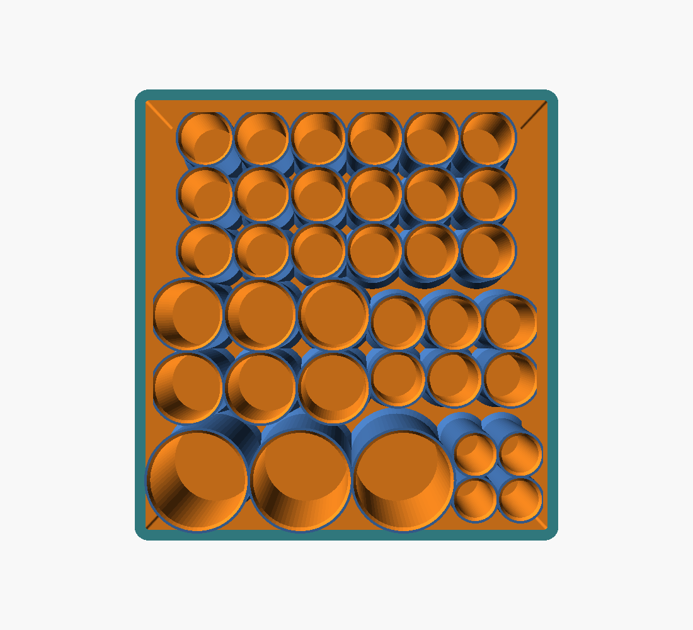
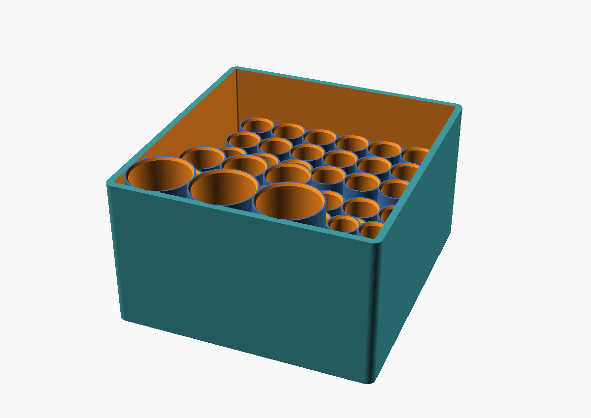
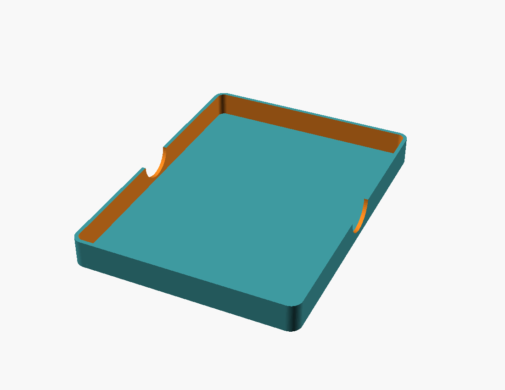
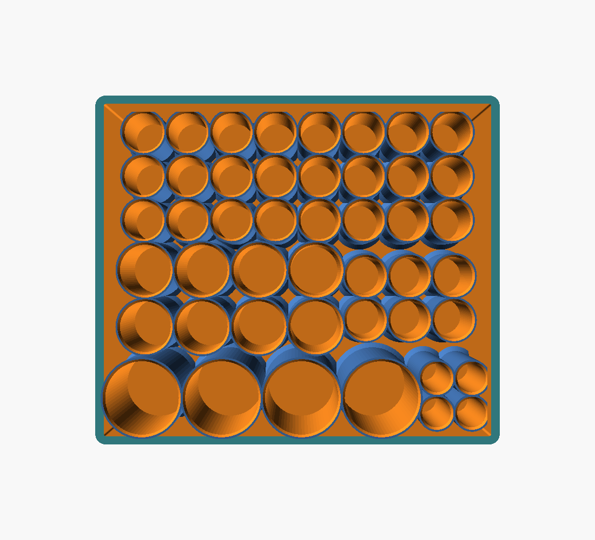
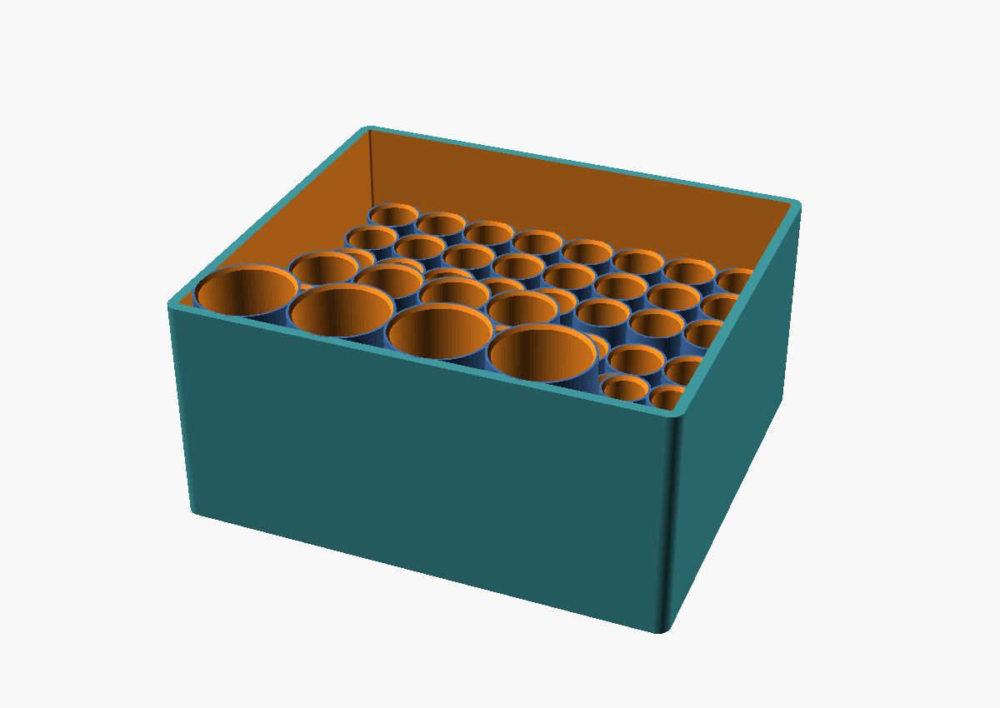
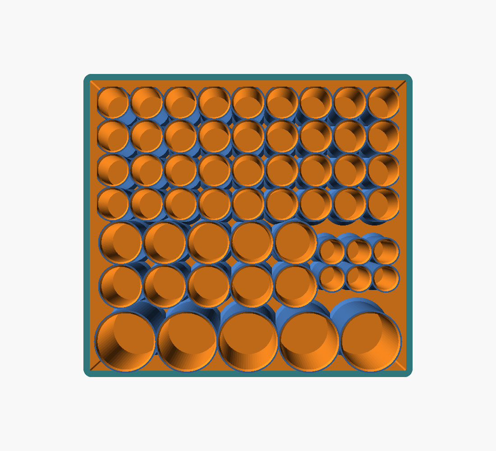
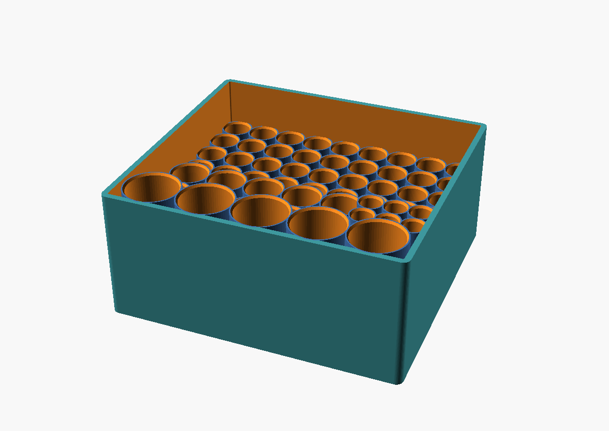
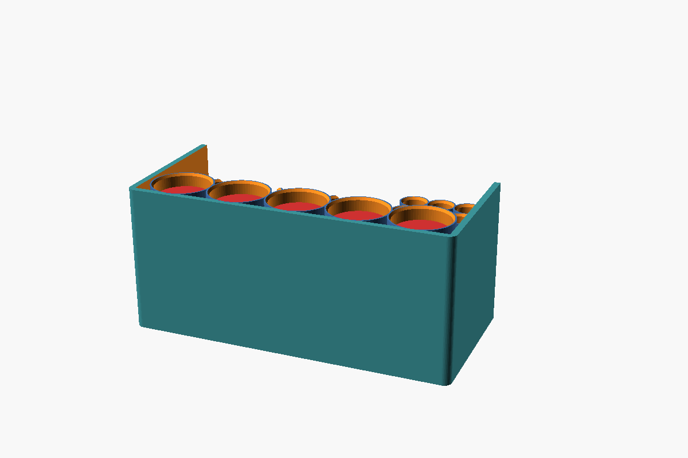
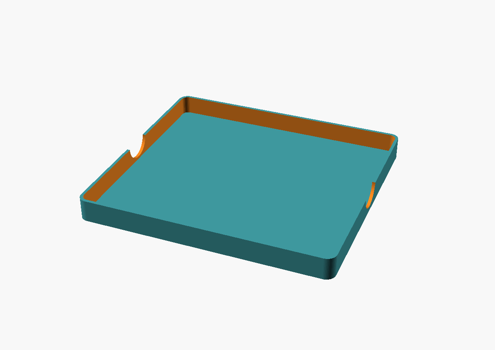

# Vial Vault — Render Gallery

Fused stepped-honeycomb designs, **reinforced against cold snapping** (45° fillet at every
cell-to-base junction + 4 mm perimeter wall). Render colors are the OpenSCAD preview
(teal/blue = walls, orange = interior) — print in **opaque dark PETG** (not PLA — PLA snaps
when cold), 4 wall lines, 15 % infill. All three are 91 mm / 3.58 in tall, fit a 220 mm bed,
and are fully light-tight (genus 0).

---

## A — Compact Honeycomb
**37 cells:** 6×10 mL · 3×30 mL · 24×1 mL · 4 syringe — **156 × 166 × 91 mm (6.14 × 6.54 × 3.58 in)** — ~330 g PETG

Top-down (layout):

3/4 view (fused honeycomb):

Lid (prints roof-down):

---

## B — Standard Honeycomb
**46 cells:** 8×10 mL · 4×30 mL · 30×1 mL · 4 syringe — **192 × 166 × 91 mm (7.56 × 6.54 × 3.58 in)** — ~400 g PETG

Top-down (layout):

3/4 view:

---

## C — Max Honeycomb
**57 cells:** 10×10 mL · 5×30 mL · 36×1 mL · 6 syringe — **204 × 188 × 91 mm (8.03 × 7.40 × 3.58 in)** — ~460 g PETG

Top-down (layout):

3/4 view (stepped honeycomb):

Cutaway — vials rest on the base, each in its own cell (red = reference vials):

Lid (prints roof-down):

